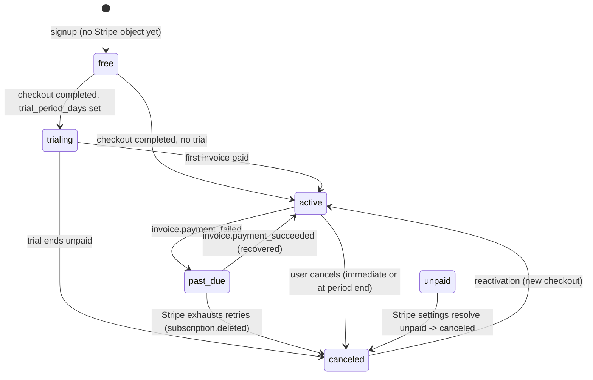
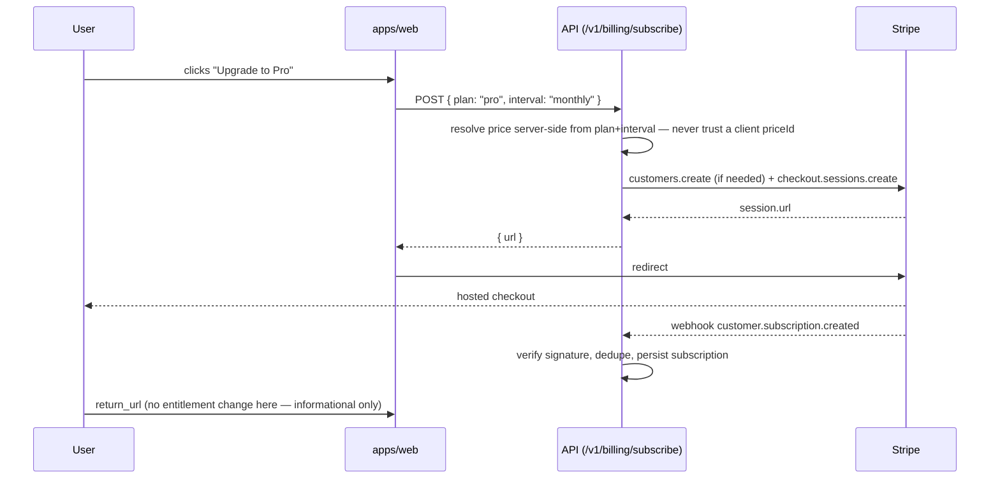
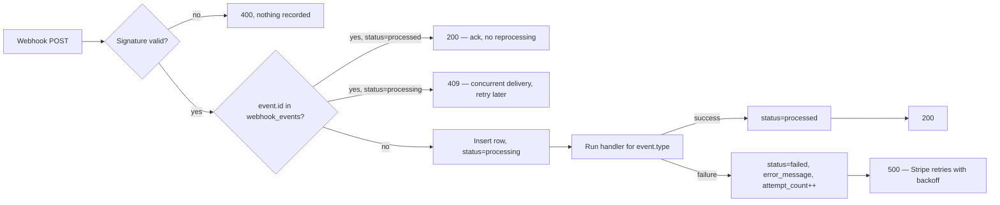
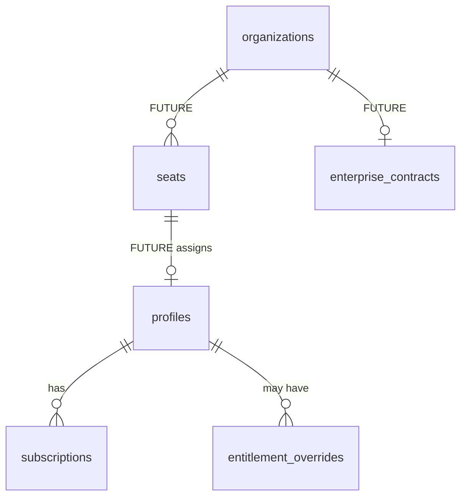

# 11 · Billing & Entitlements Architecture

Every claim below was checked against the code on `main` on 2026-09-18, not
assumed. Each item is tagged:

**EXISTING** — built and wired in. **BROKEN** — built, wired in, but does not
do what it appears to do. **MISSING** — designed for or advertised, not built.
**FUTURE** — intentionally out of scope until a real need exists.

Read this before touching `services/api/src/lib/billing.ts`, any
`subscriptions`/`billing_events` migration, or the Stripe dashboard.

---

## 1 · Current state — audited, not assumed

### 1.1 The headline finding

**There is no way, anywhere in this codebase, for a user to pay for and
receive a Pro subscription. [BROKEN]**

Trace the actual path a paying customer takes today:

1. Landing page Pro card → `href="/auth/signup?plan=pro&billing=monthly"`
   ([`apps/web/src/app/page.tsx:578`](../../apps/web/src/app/page.tsx)).
2. Signup reads `plan` only to change a headline — *"Start your pro plan —
   free to try"* — and after account creation redirects to
   `/dashboard?plan=pro` ([`auth/signup/page.tsx:41,77`](../../apps/web/src/app/auth/signup/page.tsx)).
3. `/dashboard` never reads that query parameter. It is dropped.
4. The account that was created has `profiles.plan = 'free'`, no
   `stripe_customer_id`, no `subscriptions` row, and no Stripe Checkout
   Session was ever created.

`createCheckoutSession()` and `createPortalSession()` — the two functions in
`billing.ts` that actually build a Stripe subscription Checkout Session and a
Billing Portal session — **are exported and never imported by any route.**
Confirmed by grep: zero call sites outside their own definitions.

The only route mounted at `/v1/billing` besides the webhook is
`POST /v1/billing/checkout`, and it does not do what its name and the
existing `docs/domains/billing/README.md` claimed: it calls
`createAgentCheckout` — **the marketplace agent-purchase flow**
([`marketplace.ts`](../../services/api/src/lib/marketplace.ts)), not a
subscription. **There is no `/v1/billing/portal` route at all.**

This is the corrected record — the previous domain doc was wrong on this
point and is fixed in the same change as this document.

### 1.2 What *is* real

| Component | State | Evidence |
|---|---|---|
| Stripe client, lazily constructed, never at import time | EXISTING | `lib/clients.ts` |
| Webhook signature verification | EXISTING | `billing.ts` · `stripe().webhooks.constructEvent` |
| `subscriptions`, `billing_events` tables, `profiles.stripe_customer_id` | EXISTING | `db/migrations/001_initial_schema.sql` |
| Marketplace purchase checkout + fulfillment, **idempotent** | EXISTING, sound | `marketplace.ts` · guards on `purchase.status === 'completed'` |
| Feature-capability gating by plan (`capabilitiesForPlan`) | EXISTING, sound | `packages/shared/src/capabilities.ts` |
| Free-tier AI-action quota check | EXISTING, **racy** | `lib/runs.ts` · `assertWithinPlanLimits` |
| Free-tier export quota (5/month, advertised) | **MISSING** — never checked | `routes/misc.ts` · `exportRoutes.post("/")` |
| Subscription checkout (`createCheckoutSession`) | EXISTING, **dead code** | `billing.ts:28`, zero callers |
| Billing portal (`createPortalSession`) | EXISTING, **dead code** | `billing.ts:75`, zero callers |
| Webhook idempotency | **MISSING** | see §1.4 |
| Two disagreeing plan-limit tables | **BROKEN** | see §1.3 |
| Server-side plan branching outside a shared function | 2 call sites | `routes/platform.ts:305,609` |
| Any billing test — webhook, checkout, race, idempotency | **MISSING** | zero files match `*billing*test*` |

### 1.3 Duplicated entitlement source

Two tables describe the same three plans and disagree in shape and intent:

- `PLAN_LIMITS` in `packages/shared/src/types/index.ts` — **the one actually
  read**, by `assertWithinPlanLimits` in `lib/runs.ts`.
- `PLAN_FEATURES` in `services/api/src/lib/billing.ts` — **dead code**, zero
  importers, carries its own copy of prices and limits.

These two have already drifted once in this project's own history (30 vs 20
actions/month) before being caught by hand. That is the exact failure mode
`<critical_rule>` warns about, just one level removed from `if (plan ===
"Pro")` — the duplication is between two *data tables* instead of two
`if`-branches, but the effect is identical: a limit changed in one place
silently stops being true in the other.

### 1.4 Webhook idempotency — designed backwards

```ts
// billing.ts, current shape
switch (event.type) {
  case "checkout.session.completed": await handleCheckoutCompleted(...); break;
  case "customer.subscription.updated": await handleSubscriptionUpdate(...); break;
  // …
}
await supabase().from("billing_events").insert({ stripe_event_id: event.id, ... });
```

`billing_events.stripe_event_id` **is** `UNIQUE NOT NULL` — the constraint
Stripe replay-safety needs already exists in the schema. But it is checked
**after** every handler has already run, not before, and the insert's result
is never read, so a duplicate delivery does not even surface as an error — it
silently fails to log while every handler above it has already re-executed.

Two of today's three handlers happen to tolerate this by accident:
`handleSubscriptionUpdate` upserts on `stripe_subscription_id` (safe to
repeat), and marketplace fulfillment self-guards on `purchase.status`. That
is not a design — it is two handlers that happen to be idempotent for
unrelated reasons. `handlePaymentSucceeded` / `handlePaymentFailed` currently
only `console.log`, so nothing has yet needed the ledger to actually be
enforced. The very next handler added to that switch (a dunning email, a
credit grant, a Slack alert) will not be safe by accident.

### 1.5 Usage race condition

```ts
// runs.ts — assertWithinPlanLimits
const { count } = await getAdminClient().from("agent_runs")
  .select("id", { count: "exact", head: true })
  .eq("user_id", caller.userId).gte("started_at", periodStart);
if (count >= limit) throw planLimit(...);
// … caller proceeds to insert a new agent_runs row later …
```

Classic check-then-act. Two concurrent requests at 29/30 both read
`count = 29`, both pass, both insert. The scenario `<usage_enforcement>`
describes ("user has 1 action remaining, two requests arrive simultaneously")
is not hypothetical here — it is this exact function. It fails closed on a
database error (a real prior fix — good), but it does not fail closed on a
*race*.

### 1.6 Where plan checks leak past the shared function

`capabilitiesForPlan(plan)` is a legitimate, centralized capability gate —
reuse it, do not replace it. Outside it, two server-side routes branch on the
raw string:

- `routes/platform.ts:305` — `if (me.plan === "free") throw planLimit(...)`
  gating team creation.
- `routes/platform.ts:609` — the same, gating scheduled workflows.

Both are server-side (no client-side gate was found — that part is sound),
but both are exactly the `if (plan === "Pro")` anti-pattern named in the
brief, just spelled `=== "free"`. Two instances is small; it is also exactly
how the two-plan-table drift started.

---

## 2 · Target architecture

```mermaid
flowchart TB
    subgraph Presentation
        WEB[apps/web]
        EXT[apps/extension]
    end
    subgraph BillingProvider["billing_provider (Stripe only)"]
        CO[Checkout Sessions]
        PORTAL[Billing Portal]
        WH[Webhook ingest]
    end
    subgraph SubscriptionDomain["subscription_domain (TaskPilot-owned)"]
        SUB[(subscriptions)]
        LEDGER[(webhook_events)]
    end
    subgraph EntitlementEngine["entitlement_engine"]
        CAP[capabilitiesForPlan — EXISTING]
        ENT[entitlements.can / .require — NEW]
    end
    subgraph UsageEngine["usage_engine"]
        CTR[(usage_counters) — NEW]
        RPC[atomic increment RPC — NEW]
    end
    WEB -->|create checkout| CO
    CO -->|redirect| WEB
    WH --> LEDGER
    LEDGER -->|dedup gate| SUB
    SUB --> ENT
    CAP --> ENT
    ENT -->|gate| EXECUTION[Run / export / integration execution]
    EXECUTION --> RPC --> CTR
    CTR --> ENT
```

Layer responsibilities exactly as specified, mapped to real modules:

| Layer | Owns | Module |
|---|---|---|
| `billing_provider` | Stripe only: checkout, portal, webhook receipt | `lib/billing.ts` (rewired, not replaced) |
| `subscription_domain` | Plan, period, status, cancellation | `subscriptions` table + a thin `lib/subscriptions.ts` |
| `entitlement_engine` | "Can this subject do X?" | `capabilitiesForPlan` (existing) + new `lib/entitlements.ts` |
| `usage_engine` | Consumable resources, atomically | new `usage_counters` table + `lib/usage.ts` |
| `access_control` | Enforced at the route/middleware boundary | `guard()` in `middleware/kernel.ts`, extended |
| `billing_ui` | Renders state, never computes it | `apps/web` — reads `/v1/me`, never re-derives a plan |

**Why not a bigger rewrite:** `capabilitiesForPlan`, the RLS model, the
marketplace ledger, and the `guard()` middleware are already the right shape.
The gap is narrower than a full rebuild — a real checkout/portal wiring, one
new usage table, one webhook dedup gate, and collapsing two plan tables into
one.

---

## 3 · Domain model — what's needed, what isn't

Evaluated against the brief's full entity list; only entities with a clear,
current or near-term owner are added.

| Entity | Verdict | Reasoning |
|---|---|---|
| **Customer** | Reuse `profiles.stripe_customer_id` | A dedicated table buys nothing at single-customer-per-user scale; add one only if a customer must map to more than one `profiles` row (e.g. Enterprise org billing). |
| **Subscription** | EXISTING, keep | `subscriptions` table already models this correctly. |
| **SubscriptionItem** | FUTURE | Only needed for multi-price subscriptions (seats, add-ons). Single-price today. |
| **Plan / Price** | NEW, small | See §9 — a `plan_prices` table replacing the two hardcoded tables. |
| **Entitlement** | NEW, code not table | Derived from plan + overrides; see §5. A table is added only for §3's `entitlement_overrides` (grants), not for the base rules. |
| **UsageCounter** | NEW | `usage_counters` — see §6. |
| **UsageEvent** | FUTURE | A counter is sufficient while the only consumers are two monthly caps. Add an event log when usage needs per-run attribution (billing by the run, not just gating by the month). |
| **BillingPeriod** | Implicit | Derived (`date_trunc('month', now())`), not stored — see §7. Store explicitly only when periods stop being calendar-month-aligned (annual plans, custom Enterprise cycles). |
| **Invoice / Payment** | Reuse Stripe | TaskPilot does not need its own invoice ledger; the Billing Portal (Stripe-hosted) is the source of invoice history — see §12. |
| **CheckoutSession** | Reuse Stripe's `id`, store on the row it fulfills | Marketplace already does this (`agent_purchases.stripe_session_id`); subscriptions don't need their own row, the `subscriptions.stripe_subscription_id` is sufficient. |
| **BillingEvent / WebhookEvent** | NEW shape for existing table | `billing_events` is repurposed into the durable ledger in §8; not a new table. |
| **FeatureAccess** | Code, not a table | `capabilitiesForPlan` already is this. |
| **UsageReservation** | Not needed yet | Only needed for pre-authorize-then-settle flows (e.g. metered API billing charged externally). The current model (check, then atomically record) does not need a two-phase reservation — see §6. Revisit under §14 API billing. |
| **CreditBalance** | FUTURE | No product surface asks for credits today. |
| **EnterpriseContract** | FUTURE, table shape sketched in §11 | No Enterprise checkout exists yet; do not build the table before the sales process that populates it. |
| **Seat / SeatAssignment** | FUTURE, sketched in §11 | `teams`/`team_members` exist for collaboration, not billing; do not conflate them yet. |
| **ApiKey / ApiUsage** | `ApiKey` EXISTING (`api_keys`), `ApiUsage` FUTURE | Keys already exist for developer auth; usage-based *billing* on them is §13, explicitly future. |

---

## 4 · Subscription state machine

Scoped to the enum that actually exists in the database today
(`subscription_status`), plus the one addition this design requires.



`incomplete`, `incomplete_expired`, `paused` from the brief's superset are
**not added**: this integration uses Stripe Checkout (not raw
PaymentIntents), which does not produce `incomplete`/`incomplete_expired`
subscriptions, and no product surface pauses a subscription. Adding unused
states is exactly the "entities that sound useful" anti-pattern the brief
itself warns against — if Enterprise billing later needs `paused`, add it
then, as an additive enum value (Postgres `ALTER TYPE ... ADD VALUE`, safe
without a rewrite).

**`grace_period` is not a `subscriptions.status` value** — it is a *view* over
`status = 'past_due'` combined with the invoice's retry schedule. Modeling it
as a derived read (`lib/entitlements.ts` treats `past_due` as
still-entitled-but-warned for N days) avoids a second source of truth for the
same fact Stripe already tracks via its retry schedule.

| Transition | Trigger | Entitlement effect | User-visible |
|---|---|---|---|
| `free → trialing`/`active` | `checkout.session.completed` region reconciled by the *next* `customer.subscription.*` event, never the checkout event alone | Pro capabilities granted once the subscription event confirms it | "Welcome to Pro" |
| `active → past_due` | `invoice.payment_failed` | **Kept** for a grace window (recommend 7 days, configurable), then treated as `free` | Banner: payment failed, update method |
| `past_due → active` | `invoice.payment_succeeded` | Restored | Banner clears |
| `past_due → canceled` | `customer.subscription.deleted` | Downgraded to `free` | "Your subscription ended" |
| `active → canceled` (user-initiated) | Portal cancellation → `customer.subscription.updated` with `cancel_at_period_end` | **Entitlements held until `current_period_end`**, then downgraded | "Pro until <date>" |
| `canceled → active` | New checkout | Restored; **usage history is not reset or deleted** | — |

**Never**: "checkout success ⇒ subscription active." §1.1's bug exists
precisely because nothing today waits for the webhook at all; the fix must
not replace it with "checkout *redirect* ⇒ active," which is the same bug
one layer deeper. The subscription becomes active only when a
`customer.subscription.*` event is verified and reconciled — the brief's
`<upgrade>` section is explicit about this and the design here follows it.

---

## 5 · Entitlement engine

Builds on `capabilitiesForPlan` rather than beside it.

```ts
// lib/entitlements.ts — shape, not final code
interface EntitlementSubject { userId: string; plan: PlanType; teamId?: string }

function can(subject: EntitlementSubject, capability: BrowserActionType | FeatureFlag): boolean
function require(subject: EntitlementSubject, capability: ...): void // throws ApiError("forbidden")
function getLimit(subject: EntitlementSubject, resource: "ai_actions" | "exports"): number // -1 = unlimited
```

Resolution order (composable, per `<entitlement_engine>`):

1. **Explicit override** (`entitlement_overrides` table — grandfathered
   customers, manual support grants, temporary trials). Checked first so it
   can grant *or revoke* relative to plan.
2. **Plan default** — `PLAN_LIMITS` for usage, `capabilitiesForPlan` for
   features. **One table, not two** — §9 removes `PLAN_FEATURES`.
3. **Enterprise contract override** (§11) — negotiated limits replace plan
   defaults for org members.

Every existing `if (me.plan === "free")` (§1.6) is replaced with
`require(me, "teams:create")` / `require(me, "workflows:schedule")` — new
named capabilities in the same catalogue `capabilitiesForPlan` already
serves, not a parallel system.

`getEntitlements(subject)` — the read the dashboard uses to render plan
badges and limit bars — is the **only** thing `apps/web` calls. The frontend
never re-derives "am I Pro" from a JWT claim, `localStorage`, or a redirect
query parameter; it renders what this function returns.

---

## 6 · Usage engine — race-safe by construction

Replace the count-then-insert in `assertWithinPlanLimits` with an atomic
increment against a dedicated counter, not a `SELECT count()` over the event
table.

```sql
CREATE TABLE usage_counters (
  user_id      UUID NOT NULL REFERENCES profiles(id) ON DELETE CASCADE,
  resource     TEXT NOT NULL,              -- 'ai_actions' | 'exports'
  period_start DATE NOT NULL,              -- first day of the UTC month
  used         INT  NOT NULL DEFAULT 0,
  PRIMARY KEY (user_id, resource, period_start)
);
```

```sql
-- Atomic: one round trip, row-locked, no read-then-write gap.
CREATE FUNCTION try_consume_usage(p_user_id UUID, p_resource TEXT, p_limit INT)
RETURNS BOOLEAN AS $$
  INSERT INTO usage_counters (user_id, resource, period_start, used)
  VALUES (p_user_id, p_resource, date_trunc('month', now())::date, 1)
  ON CONFLICT (user_id, resource, period_start)
  DO UPDATE SET used = usage_counters.used + 1
  WHERE p_limit < 0 OR usage_counters.used < p_limit
  RETURNING TRUE;
$$ LANGUAGE sql;
```

`p_limit < 0` (unlimited) always matches so Pro/Enterprise never pay the
`WHERE` cost of a real comparison. Two concurrent calls at `used = 29,
limit = 30` serialize on the row lock Postgres already takes for the
`ON CONFLICT ... DO UPDATE`; exactly one returns a row past the limit, the
other's `WHERE` fails and it returns no row — which is the atomic "reserve or
fail" the brief asks for, without a separate reservation/release pair (a
consumed unit is not released — an AI action or export that ran does not get
refunded by failing later; this matches "database correctness over
optimistic UI state").

This also **fixes §1.2's missing export enforcement** for free — the same
function, called with `resource = 'exports', limit = 5`, replaces the
no-op in `exportRoutes.post("/")`.

`agent_runs`/existing tables stop being the quota source; they remain the
audit trail (`<data_integrity>`: usage events are idempotent, historical
usage is immutable — the counter is the gate, the run rows are the record).

---

## 7 · Usage periods

Free-tier limits reset on the **UTC calendar month** — already the behavior
in `runs.ts` (`periodStart.setUTCDate(1)`), preserved here, not changed:
predictable, matches "30 AI actions / month" as advertised without a
per-user anniversary date to track.

| Case | Behavior |
|---|---|
| Mid-period upgrade (Free → Pro) | Existing `usage_counters` row for the month is left as-is (harmless — Pro's `-1` limit ignores it); no reset needed since the limit check no longer applies. |
| Mid-period downgrade (Pro → Free) | The free-tier counter for the *current* month starts at whatever was already consumed while still Pro is **not** double-charged — Pro never wrote to `usage_counters` (its limit is `-1`, short-circuited), so a downgraded user gets a full fresh 30/5 for the remainder of the month they downgraded in. Documented as the chosen policy, not left implicit. |
| Cancellation → reactivation later | New month, new row (`period_start` differs) — no manual reset required. |
| Enterprise custom periods | Out of scope until an Enterprise contract exists (§11); `period_start` is a `DATE`, so a future non-calendar cycle is a value change, not a schema change. |

---

## 8 · Stripe integration & webhook architecture

### 8.1 Checkout — wiring the dead code in, not writing new code



`POST /v1/billing/subscribe` (new — distinct from the existing
`/v1/billing/checkout`, which stays exactly what it is: marketplace agent
purchase). The route accepts `{ plan: "pro" | "enterprise", interval }`, an
**enum**, and resolves the Stripe Price ID from `stripePrices()` server-side
— never a client-supplied `priceId`, per `<checkout>`'s explicit requirement.

`return_url`'s page shows "finishing setup…" and polls `/v1/me`, not "you are
now Pro" — because per §4, the redirect is not the source of truth.

### 8.2 Billing portal — wire in, don't rebuild

`createPortalSession` already exists and is correct. Add
`POST /v1/billing/portal`, requiring an existing `stripe_customer_id`.
Payment-method updates, invoice history, and self-serve cancellation are
Stripe's UI — TaskPilot does not rebuild any of them (`<billing_portal>`).

### 8.3 Webhook ledger — dedupe before, not log after



Repurpose `billing_events` into this ledger (rename in a migration, keep the
existing unique constraint):

```sql
ALTER TABLE billing_events RENAME TO webhook_events;
ALTER TABLE webhook_events
  ADD COLUMN provider TEXT NOT NULL DEFAULT 'stripe',
  ADD COLUMN processing_status TEXT NOT NULL DEFAULT 'processing'
    CHECK (processing_status IN ('processing','processed','failed')),
  ADD COLUMN attempt_count INT NOT NULL DEFAULT 1,
  ADD COLUMN error_code TEXT,
  ADD COLUMN error_message TEXT,
  ADD COLUMN received_at TIMESTAMPTZ NOT NULL DEFAULT now();
-- processed_at already exists and is repurposed as "handler finished at"
```

The existing `metadata JSONB` column currently stores `event.data.object` —
the **entire** Stripe object, which for a subscription or invoice event
includes more than TaskPilot needs to retain (`<privacy>`: store the minimum
necessary; `<webhook_events>`: do not store unnecessary sensitive payment
data). Trim to `{ id, object, customer, subscription, status }` — enough to
debug and reconcile, not a payment-data mirror.

**Order is not trusted.** `customer.subscription.updated` can arrive before
or after `invoice.payment_succeeded` for the same billing cycle; the handler
always reads the subscription's *current* status from the event payload and
upserts, so an out-of-order delivery converges to the same end state either
way rather than depending on arrival order.

### 8.4 Idempotency checklist against `<idempotency>`

| Operation | Mechanism |
|---|---|
| Checkout creation | Stripe `idempotency_key` = a hash of `(userId, plan, interval, day)` — a retry within the same request does not create two Sessions |
| Customer creation | `getStripeCustomerId` lookup before create (existing) — add a unique index on `profiles.stripe_customer_id` (already `UNIQUE`) as the backstop against a race creating two |
| Subscription sync | Upsert on `stripe_subscription_id` (existing, correct) |
| Webhook processing | §8.3 ledger, checked before dispatch |
| Usage recording | §6's `ON CONFLICT` |
| Cancellation | Idempotent by construction — canceling an already-canceled Stripe subscription is a no-op Stripe itself handles |
| Plan changes | Always driven by the *current* subscription snapshot in the event, never a delta — replaying the same event twice converges, doesn't double-apply |

---

## 9 · Pricing configuration — one table, not two

```sql
CREATE TABLE plan_prices (
  plan            plan_type NOT NULL,
  interval        TEXT NOT NULL CHECK (interval IN ('month','year')),
  stripe_price_id TEXT NOT NULL,
  amount_cents    INT NOT NULL,        -- integer minor units, never float
  currency        TEXT NOT NULL DEFAULT 'usd',
  active          BOOLEAN NOT NULL DEFAULT true,
  PRIMARY KEY (plan, interval)
);
```

Seeded from today's real values — **$39.99/mo → `3999`, $383.90/yr →
`38390`** cents, matching `<currency>`'s requirement exactly (the current
`PLAN_FEATURES.price_monthly = 39.99` is a float; this replaces it, it does
not add a third source).

`PLAN_LIMITS` (usage caps) and `PLAN_FEATURES` (marketing copy + price)
collapse: **`PLAN_LIMITS` stays as the single usage-limit source** (already
correct in shape); `plan_prices` becomes the single price source; the
pricing page and `/v1/me` both read from the same two tables instead of each
maintaining a copy. `PLAN_FEATURES` is deleted, not deprecated-in-place —
dead code with no callers is a liability the moment someone "helpfully"
starts reading it again.

---

## 10 · Database changes — complete list, additive only

| Change | Type | Reason |
|---|---|---|
| `usage_counters` | New table | §6 |
| `try_consume_usage()` | New function | §6 |
| `plan_prices` | New table | §9 |
| `entitlement_overrides` | New table (small) | §5 — `(user_id, capability, granted BOOLEAN, expires_at, reason, granted_by, created_at)` |
| `billing_events` → `webhook_events` | Rename + columns | §8.3 |
| Drop `PLAN_FEATURES` (code, not DB) | Deletion | §9 |
| `subscriptions`, `profiles.plan`, `profiles.stripe_customer_id` | Unchanged | Already correct |

No destructive migration touches existing rows. The rename in §8.3 keeps the
existing unique constraint and primary key; new columns are all
`NOT NULL DEFAULT` or nullable, so it is safe to run against a populated
table without a backfill step.

---

## 11 · Enterprise & seats — architecturally possible, not built

Do not build `organizations`/`seats` tables now — no Enterprise checkout
exists to populate them, and building the shape before the sales process
that needs it risks guessing wrong. What this design *does* guarantee is that
adding them later does not require touching the entitlement engine:



Because §5's resolution order already checks "contract override" *before*
falling back to plan defaults, an `EnterpriseContract` row later becomes
another entry at the same resolution step — `require(subject, cap)` does not
change shape, only what it consults. This is what `<enterprise>` asks for:
overrides coexisting with standard plans without branching the codebase.

`teams`/`team_members` (existing, migration `005_teams.sql`) are
**collaboration**, not billing seats — a team's Pro-gate today is
"the creating user's own plan," not per-member billing. Do not conflate the
two tables when Enterprise seats are eventually built; a `Seat` is a billing
relationship, a `team_member` is a collaboration relationship, and the same
person is likely both without the rows needing to merge.

---

## 12 · What stays with Stripe

Per `<billing_portal>`, TaskPilot does not rebuild:

- Payment method storage (Stripe Elements / Checkout only — no card data
  ever reaches TaskPilot's server, satisfying `<privacy>` by construction)
- Invoice history and PDF receipts (Billing Portal)
- Dunning email sequences on `past_due` (Stripe Smart Retries)
- Tax calculation (Stripe Tax, if enabled)

TaskPilot owns: which plan a user is on *right now* (for authorization
decisions that must not block on a Stripe API call), and usage.

---

## 13 · API usage billing — future, architected for

Not built. The shape that makes it addable later without a rewrite:

- `api_keys` (existing) already carries `scopes` and an owning `user_id` —
  the attribution unit API usage billing needs already exists.
- `usage_counters.resource` is a free-text column (§6) — `'api_requests'`
  is a new row shape, not a new table.
- Rate limiting is already per-key (`docs/api/README.md` — Redis-backed,
  memory fallback) — the same counter that limits *rate* is architecturally
  adjacent to the one that would limit *billed volume*, without being the
  same counter (rate resets per-minute; billing resets per-period).

Nothing here is implemented now, per the brief's explicit instruction not to
build API billing before it's required.

---

## 14 · Security model

| Threat (`<billing_security>`) | Mitigation |
|---|---|
| Forged webhook | `stripe().webhooks.constructEvent` — unchanged, already correct |
| Replayed webhook | §8.3 ledger — new |
| Manipulated price ID | §8.1 — plan is an enum, price resolved server-side — new |
| Client-side entitlement manipulation | `/v1/me` is the only source `apps/web` reads; nothing is computed client-side — reinforced, not new |
| Usage counter races | §6 atomic RPC — new |
| Stripe secret exposure | Already never `NEXT_PUBLIC_*` — verified, unchanged |
| Insecure admin billing ops | §15 — new |

The Chrome extension (`<browser_extension>`): confirmed it holds no Stripe
key today (only `apps/web`/`services/api` import `stripe`). It may cache
`can(subject, cap)` results for snappy UI, but every server route it calls
re-checks server-side regardless of what the extension believes — no change
needed here, the existing `guard()` scopes model already enforces this
per-request.

---

## 15 · Admin, observability, reconciliation

**Admin** (new, small surface): `GET /v1/admin/billing/:userId` (subscription
+ usage + override history), `POST /v1/admin/entitlements/grant` (writes to
`entitlement_overrides`, requires an admin scope, always logged with
`granted_by`). No direct DB console edits to `profiles.plan` — every manual
change goes through the same table the entitlement engine reads, so an
override is visible in the same audit trail as an automatic one.

**Observability**: emit the metrics list from `<observability>` as
structured log lines with a `correlation_id` = the Stripe event ID (webhooks)
or request ID (checkout) — no new telemetry infrastructure required, this
project already logs structurally (`server.ts` boot log pattern).

**Reconciliation**: a scheduled job (reuses the existing `job_queue` +
worker pattern, `docs/architecture/07_EVENT_ARCHITECTURE.md`) that lists
Stripe subscriptions for customers with a `stripe_customer_id` and diffs
against local `subscriptions` rows, flagging (never auto-correcting) drift
into a `reconciliation_flags` row for manual review — "never blindly
overwrite valid state" per `<reconciliation>`.

---

## 16 · Testing strategy

Zero billing tests exist today (§1.2) — this is the largest concrete gap next
to the missing checkout route. Minimum set, mapped to existing test patterns
in this repo (`vitest`, `db/tests/migrations.test.mjs` style for DB-level
checks):

| Test | Verifies |
|---|---|
| Signature rejection | Wrong/missing `stripe-signature` → `400`, nothing written |
| Duplicate event | Same `event.id` twice → handler runs once, second call short-circuits |
| Out-of-order events | `invoice.payment_succeeded` before `customer.subscription.updated` → same end state as reverse order |
| Concurrent usage consumption | N parallel calls to `try_consume_usage` at `limit - 1` remaining → exactly one succeeds |
| Plan resolution | Every `stripePrices()` value maps to exactly one plan; an unknown price ID fails closed, not defaults to `pro` (§1's `getPlanFromPriceId` currently defaults unknown → `"pro"` — flagged as a real bug to fix in implementation, not just document) |
| Downgrade preserves history | `agent_runs`, `usage_counters` rows survive a plan change |
| Free tier never touches Stripe | `hasStripeCredentials() === false` → free signup, free usage all still work |
| Export quota | 6th export in a month on Free → `402 plan_limit`, matching the AI-action behavior |

---

## 17 · Implementation plan — dependency ordered

Each step is independently shippable and testable; none requires the ones
after it to be safe to deploy.

| # | Step | Depends on | Rollback |
|---|---|---|---|
| 1 | Fix `getPlanFromPriceId` fail-closed on unknown price | — | Revert one function |
| 2 | `usage_counters` + `try_consume_usage`, wire into `assertWithinPlanLimits` and `exportRoutes` | — | Old count-query path kept behind a flag until this is verified in production, then deleted |
| 3 | `webhook_events` rename + dedupe gate in `handleWebhookEvent` | — | Additive migration; old behavior was "no gate," so this only makes behavior stricter, never looser |
| 4 | `plan_prices` table + delete `PLAN_FEATURES` | 1 | Migration is additive; deletion of dead code has no runtime effect to roll back |
| 5 | `POST /v1/billing/subscribe` (wires `createCheckoutSession`) | 1, 4 | New route; remove route to roll back |
| 6 | `POST /v1/billing/portal` (wires `createPortalSession`) | — | New route |
| 7 | Wire `apps/web` pricing CTA → `/v1/billing/subscribe`, remove `?plan=` cosmetic param | 5 | Revert CTA href |
| 8 | Replace `platform.ts:305,609` inline checks with `entitlements.require` | 4 | Mechanical, low risk |
| 9 | `entitlement_overrides` + admin grant/inspect routes | 4 | New, additive |
| 10 | Reconciliation job | 3, 5 | Read-only job; disable the cron entry to roll back |

Steps 1–4 are pure hygiene and race-safety fixes with no dependency on a live
Stripe account state change — safe to do first. Steps 5–7 are the one that
actually lets a customer pay; that is also the one most worth a deliberate,
reviewed rollout (test-mode Stripe keys, a small internal test purchase)
rather than shipping silently.

---

## 18 · Acceptance checklist — current status

| Criterion | Status today |
|---|---|
| Stripe secrets never reach the browser | ✅ Pass |
| Client input cannot determine entitlements | ✅ Pass (no client-side gate found) |
| Free users use the same entitlement engine as paid | ⚠️ Partial — `capabilitiesForPlan` yes, usage limits split across two tables |
| Plan checks are centralized | ❌ Two inline checks outside the shared function (§1.6) |
| Usage enforcement is server-side | ✅ Pass |
| Usage limits are race-safe | ❌ Fails (§1.5) |
| Usage events are idempotent | ⚠️ N/A today — no event log exists yet, only a racy counter |
| Webhooks are signature-verified | ✅ Pass |
| Webhooks are idempotent | ❌ Fails (§1.4) |
| Webhooks tolerate out-of-order delivery | ⚠️ Accidentally, not by design |
| Subscription state is persisted locally | ✅ Pass |
| Stripe is not queried per authorization decision | ✅ Pass |
| Billing state can be reconciled | ❌ No process exists |
| Enterprise overrides supported architecturally | ⚠️ Designed here (§11), not built |
| Seat-based billing addable without a rewrite | ✅ By design (§11) |
| API usage billing addable later | ✅ By design (§13) |
| Billing operations are observable | ❌ `console.log` only |
| Admin billing actions are audited | ❌ No admin surface exists |
| Financial values use integer minor units | ❌ `PLAN_FEATURES.price_monthly = 39.99` (float; deleted in §9) |
| Historical billing records not destructively mutated | ✅ Pass (append-only so far) |
| Failed payment behavior explicitly defined | ⚠️ Handler exists, does nothing (§1) — defined here (§4), not implemented |
| Cancellation behavior explicitly defined | ⚠️ Defined here (§4), not implemented |
| Upgrade behavior explicitly defined | ⚠️ Defined here (§4/§8.1) — **not implemented; upgrade does not work today** |
| Downgrade behavior explicitly defined | ✅ Defined here (§7) |
| Tests cover duplicate/concurrent operations | ❌ Zero billing tests exist |
| No duplicate billing subsystem introduced | This design collapses the existing duplication rather than adding a third |

---

## 19 · Related documents

- [`docs/domains/billing/README.md`](../domains/billing/README.md) — corrected
  in the same change as this document to remove the inaccurate portal/checkout
  claim.
- [`docs/architecture/08_SECURITY_MODEL.md`](08_SECURITY_MODEL.md) — trust
  boundaries this design does not change.
- [`docs/architecture/07_EVENT_ARCHITECTURE.md`](07_EVENT_ARCHITECTURE.md) —
  the job-queue pattern §15's reconciliation job reuses.
- [`docs/api/README.md`](../api/README.md) — needs a `/v1/billing/subscribe`
  and `/v1/billing/portal` entry once §17 step 5–6 ship; not added yet since
  the routes don't exist.

No other numbered document in `docs/architecture/` needs a change for this
audit alone — `04_DOMAIN_MODEL.md`'s billing section is a one-line reference
this document now supersedes for depth, not a page needing corrections.
