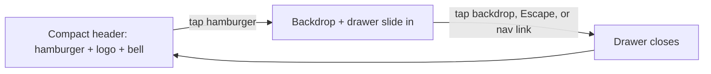

# 12 · Mobile & Responsive Architecture

This document follows the same rule as the rest of `docs/architecture/`:
every claim is checked against the code, not assumed. Where a full audit of
a surface has not happened yet, it says so — this is not a claim that
TaskPilot is fully mobile-ready end to end.

**Naming note:** an earlier brief for this work asked for
`docs/20.1_MOBILE_RESPONSIVE_ARCHITECTURE.md`. This repo's architecture docs
are numbered `00`–`11` in one flat sequence (see
[docs/README.md](../README.md)), so this continues that sequence as `12`
rather than introducing a second, incompatible numbering scheme.

---

## 1 · What this pass covered, and what it didn't

TaskPilot has 26 routes. A genuine "every route, every breakpoint" audit —
workflow canvas editing, the AI Sidebar composer under a mobile keyboard,
browser-action approval flows, a full WCAG 2.2 pass — is real design and
engineering work, not something to wave through in one pass. This document
is honest about the difference between what was actually inspected and fixed
versus what remains.

**Inspected:** every route's layout code for hardcoded grids, fixed widths,
and table markup, via direct search of the source, not a guess from route
names. **Fixed:** the issues that search surfaced and that were verified live
in a browser at 375px, 768px, and 1280px. **Not done:** a redesign of the
complex, genuinely-hard surfaces (workflow canvas, AI Sidebar, browser
actions) — see §7.

---

## 2 · The headline finding

**Every one of TaskPilot's 15 authenticated dashboard routes shared a single
non-responsive shell.** `components/dashboard/shell.tsx` laid out the whole
dashboard as a fixed CSS Grid, `236px 1fr`, with a `position: sticky; height:
100vh` sidebar and no media query anywhere in the component. Below roughly
600px, every dashboard page was squeezed into whatever remained after a
236px column that could not be hidden or collapsed — there was no hamburger,
no drawer, nothing to reclaim the space. This is now fixed (§3) and is the
single highest-leverage change in this pass: it is the shell every dashboard
route renders inside.

For scale: `apps/web/src/app/globals.css`, the entire design system's
stylesheet, contained exactly **one** media query before this change
(`.ui-container` padding at 640px). The public marketing pages
(`page.tsx`) already had their own responsive nav and pricing grid from
earlier work — the dashboard had none of that.

---

## 3 · Fixed: the dashboard shell

`components/dashboard/shell.tsx` — rewritten, not patched around.

**Desktop (≥860px):** unchanged. Sticky `236px` sidebar, same nav sections,
same footer, same notification bell placement.

**Mobile (<860px):** the sidebar becomes an off-canvas drawer.

- One `<aside>`, one set of nav markup — desktop and mobile read the exact
  same `NAV_SECTIONS` array. The breakpoint changes CSS (`position`,
  `transform`), not which component tree renders, so there is no duplicated
  mobile/desktop implementation to keep in sync.
- Body scroll is locked while the drawer is open; `Escape` closes it; the
  drawer closes automatically on every route change (a stale open drawer
  after a navigation is a common half-finished-drawer bug — this session
  found and fixed several patterns of it elsewhere too).
- `aria-expanded`, `aria-controls`, `aria-modal`, and a labeled close button
  are present — a drawer that is only operable by tapping outside it is not
  accessible.
- `env(safe-area-inset-top)` on the mobile header, `env(safe-area-inset-
  bottom)` on the drawer — scoped to this one component, not applied
  globally (the brief this followed explicitly warns against adding safe-area
  padding globally without checking the actual layout consequence).
- Breakpoint (`860px`) is a named constant in the file, not a magic number
  repeated in three places.

**Verification limit, stated plainly:** this was verified by code review and
a clean production build/type-check, **not** by driving it in a real,
authenticated browser session. Every dashboard route sits behind sign-in,
and this session does not create test accounts (a standing rule, not an
oversight). If the drawer behaves differently than described here on a real
device, that gap is exactly here — tell me what you see and it gets fixed
directly, the same way the marketplace header bug in §5 was found by
actually looking, not by assuming the code was fine.

---

## 4 · Fixed: three forms with a fixed two-column grid

`grep` across every dashboard route for `gridTemplateColumns` found three
forms hardcoded to `'1fr 1fr'` or `'2fr 1fr'` with no responsive fallback —
at 320–375px this squeezes two form fields (a category picker and something
else, a workflow name and something else, an API key name and its expiry)
into roughly 150px each, clipping labels and placeholders.

| File | Was | Now |
|---|---|---|
| `dashboard/agents/page.tsx:361` | `'1fr 1fr'` | `repeat(auto-fit,minmax(180px,1fr))` |
| `dashboard/workflows/page.tsx:311` | `'1fr 1fr'` | `repeat(auto-fit,minmax(180px,1fr))` |
| `dashboard/developers/page.tsx:216` | `'2fr 1fr'` | `repeat(auto-fit,minmax(180px,1fr))` |

`auto-fit`/`minmax` is not a new pattern introduced for this fix — it is
already how most of this codebase's grids behave (`dashboard/page.tsx`,
`dashboard/analytics/page.tsx`, `dashboard/marketplace/page.tsx` all already
used it correctly). These three forms were the exceptions, not a systemic
problem, and the fix makes them consistent with the rest of the app rather
than introducing a new pattern.

---

## 5 · Fixed: the public marketplace header overflowed on real mobile

Found by actually loading `/marketplace` at 375px in a browser, not by
reading the code — this is exactly why `<visual_validation>`'s instruction
not to declare readiness from a successful build matters. The header
(`components/marketplace/header.tsx`) is a plain flex row: logo, a
"Marketplace" text label, then two buttons ("My library", "Dashboard"). At
375px the combined width exceeds the viewport and "Dashboard" was clipped
off the right edge.

Fix: the "Marketplace" label — redundant with the page's own `<h1>` right
below it — is hidden below 480px, freeing the width the two actions need.

**A real mistake made and caught in the same pass, worth recording:** the
first attempt added a CSS class with a `@media` rule to hide the label, and
it did nothing — because the element also carried an inline `style={{
display: 'flex' }}`, and an inline style always wins over a stylesheet rule
regardless of the media query or selector specificity. This is a trap this
codebase's inline-style-heavy convention makes easy to fall into repeatedly;
the fix needed `!important` on the override specifically because the
existing pattern is inline styles, not classes. Anyone adding a future
responsive override to a component styled this way will hit the same trap —
this paragraph exists so they don't have to rediscover it.

Verified fixed at 375px and confirmed **unchanged** at a true 1280px desktop
width (the label is present, nothing shifted).

---

## 6 · Fixed: the Browser Actions history table

`dashboard/actions/page.tsx` rendered a 5-column table (Action, Trigger,
Runs, Last run, Status) inside a `div.overflow-hidden` — not `overflow-x-
auto`. That means content past the viewport edge was silently **clipped**,
not scrollable — a real, if quiet, version of the "broken table" the brief
asks to look for.

Per the brief's own instruction not to default to `overflow-x-auto`
everywhere, this became stacked cards below 640px instead: one card per
action, the same five fields as a labeled key/value list, name and status on
one line (status is the thing a person glances at first), trigger and run
count side by side, last-run full width. Same `ranActions` array powers
both renderings — no separate mobile data-fetch path, no duplicated
pagination logic. Table and card list are two CSS-toggled blocks in the same
render, not two components — cheap for this dataset size, and it means there
is exactly one source of truth for the row markup logic to drift from, not
two.

---

## 7 · Explicitly not done in this pass — FUTURE WORK

Naming these rather than letting a "mobile-ready" claim imply they're
covered:

| Surface | State |
|---|---|
| Workflow canvas / step editor | Not audited. The brief's own guidance — don't shrink a complex canvas into a miniature desktop one, redesign the interaction — is a real design task, not a CSS pass. |
| AI Sidebar composer + mobile keyboard | Not audited. Needs real device testing (`env(keyboard-inset-height)` support varies), not just code review. |
| Browser Actions approval/confirmation dialogs | Not audited beyond the history table fixed in §6. |
| Billing / plan comparison | **Already correct** — `.lp-price` on the landing page already collapses to one column below 900px (prior session work). Not re-verified against every acceptance point in the original brief (invoices, portal — see [11_BILLING_ARCHITECTURE](11_BILLING_ARCHITECTURE.md), which found the portal route doesn't exist yet regardless of viewport). |
| Settings page | Not audited — the route exists but is a minimal placeholder (1.73kB in the build output), so a mobile-specific pattern doesn't yet have real content to apply to. |
| Analytics charts | Not audited for small-viewport legibility. |
| WCAG 2.2 AA | Not run as a formal pass. The dashboard shell drawer (§3) got explicit `aria-*` and keyboard support because it was being rewritten anyway; that is not the same as an accessibility audit of the other 25 routes. |
| Automated responsive/E2E tests | None added. No Playwright or similar browser-test infrastructure exists in this repo today (`pnpm test` is Vitest, unit/integration only) — introducing one is a real infrastructure decision, not a byproduct of a CSS fix pass. |
| Performance (bundle, images, fonts) | Not audited in this pass. |
| Tablet/landscape, iOS Safari/Android Chrome device-specific quirks | Not tested on real devices — verification here used Chromium viewport emulation only. |

---

## 8 · Principles this pass followed, for whoever continues it

**Prefer the pattern already in the codebase over inventing a new one.**
`repeat(auto-fit,minmax(Npx,1fr))` was already the dominant grid pattern
here; the fix for §4 used it rather than adding media queries that would
have been the third or fourth distinct responsive technique in the same
file.

**A component styled with inline `style={{}}` needs `!important` for a
media-query override, every time.** See §5. This is worth fixing at the
source eventually (moving layout-critical inline styles to classes so
overrides don't need `!important`), but that is a larger refactor than this
pass, and `!important` scoped to one small, well-commented override is an
honest, working fix, not a hack papering over a screenshot.

**One drawer, one set of markup, breakpoint-controlled by CSS.** Every fix in
this document shares the same table markup, the same card markup, the same
nav markup across breakpoints — nothing here introduces a "mobile version"
of a component that could drift from its desktop counterpart over time.

**State the verification boundary.** §3 says plainly that the shell fix was
not driven in a real authenticated session. A responsive fix that cannot be
demonstrated live is still worth shipping when the reasoning is sound and
the build is clean — but claiming it was seen working when it wasn't is
exactly the failure mode `<visual_validation>` warns against.

---

## 9 · Validation performed

| Check | Result |
|---|---|
| `pnpm --filter @taskpilot/web type-check` | Pass |
| `pnpm --filter @taskpilot/web build` | Pass, clean |
| `pnpm test` (full suite) | 415/415 pass, 18 files |
| Live viewport check, `/` (landing) | 375px — clean, hamburger nav works (prior session work, reconfirmed) |
| Live viewport check, `/marketplace` | 375px — header overflow found and fixed; 1280px — confirmed unaffected |
| Live viewport check, `/auth/login` | 375px — clean, no changes needed |
| Authenticated `/dashboard/*` routes | **Not driven live** — see §3's verification limit |

---

## 10 · Files changed

- `apps/web/src/components/dashboard/shell.tsx` — responsive rewrite (§3)
- `apps/web/src/app/dashboard/agents/page.tsx` — grid fix (§4)
- `apps/web/src/app/dashboard/workflows/page.tsx` — grid fix (§4)
- `apps/web/src/app/dashboard/developers/page.tsx` — grid fix (§4)
- `apps/web/src/app/dashboard/developers/docs.tsx` — fixed sidebar → horizontal scroll strip below 700px
- `apps/web/src/components/marketplace/header.tsx` — overflow fix (§5)
- `apps/web/src/app/dashboard/actions/page.tsx` — table → cards below 640px (§6)
- `.claude/launch.json` (both copies — repo root and worktree) — the dev-server
  launch command itself was broken (`next dev -- -p 3100` doesn't parse; fixed
  to `pnpm exec next dev -p 3100`), unrelated to responsive work but it blocked
  live verification until fixed
