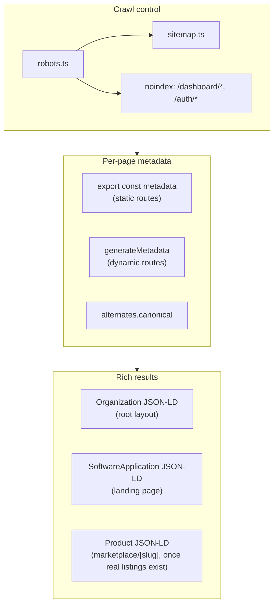

# 13 · SEO Architecture

A plan, audited against the live code on 2026-09-21 — every finding below
names the file it comes from, not a guess about what a Next.js app
"probably" has. §8 separates what needed no decision from what needs one;
the six no-decision items shipped the same day this document was written —
see §8's status column and [apps/web/src/lib/site.ts](../../apps/web/src/lib/site.ts)
onward for what actually landed. §2's findings are left as originally
written even where since fixed, so this stays a record of what was found,
not just what remains.

---

## 1 · What's already right — don't rebuild this

`apps/web/src/app/layout.tsx` carries a genuinely solid metadata baseline:
title template, description, keywords, `openGraph`, `twitter`, `robots`
directives, and font loading via `next/font` with `display: 'swap'` (no
render-blocking font request, no cumulative-layout-shift risk from web
fonts). 10 of the 11 public marketing routes already export their own
`metadata` — `about`, `blog`, `careers`, `changelog`, `marketplace`,
`marketplace/[slug]`, `privacy`, `roadmap`, `security`, `terms`. The dynamic
agent page (`marketplace/[slug]/page.tsx:27`) already uses
`generateMetadata` to produce a real per-agent title and description —
correct programmatic-SEO shape for when the marketplace has real listings.

**Zero raster images anywhere in `apps/web/src`** (`grep ` to `next/image`" SEO task simply doesn't
apply here — worth stating explicitly so nobody spends time on it.

The redesign work already done this quarter (mobile drawer nav, responsive
grids — see [12_MOBILE_RESPONSIVE_ARCHITECTURE](12_MOBILE_RESPONSIVE_ARCHITECTURE.md))
matters here too: mobile usability is a Google ranking input, not a separate
concern from SEO.

---

## 2 · Findings — ranked by how much they cost right now

### Critical

**The Open Graph and Twitter Card image referenced site-wide does not
exist.** `layout.tsx` points both `openGraph.images` and `twitter.images` at
`/og-image.png`. `apps/web/public/` contains no such file — confirmed by
directory listing, not inference. Every link to any TaskPilot page shared on
Slack, X, LinkedIn, or iMessage renders with a broken image today. This is
the single highest-impact, lowest-effort fix on this list: one image file
fixes every page at once because it's set once in the root layout.

**No `sitemap.xml`.** No `sitemap.ts` anywhere under `apps/web/src/app`.
Google can still crawl via internal links, but a sitemap is how you tell it
*which* URLs are canonical and how often they change — without one, a
dynamic route like `marketplace/[slug]` is discovered only by Google
crawling the listing page and following links, which is slower and less
reliable than declaring them.

**No `robots.txt`.** No `robots.ts`. There is a per-page `robots` meta
directive in `layout.tsx` (`index: true, follow: true`), but that is not a
substitute — `robots.txt` is what points crawlers at the sitemap and is
where `/dashboard/*` and `/auth/*` should be excluded from crawl budget
entirely (see next finding).

### High

**Every `/dashboard/*` and `/auth/*` route is indexable by default.**
`robots: { index: true, follow: true }` is set once, globally, in the root
layout, and nothing overrides it for the 13 dashboard routes or the 4 auth
routes. In practice `RequireAuth` redirects an unauthenticated crawler to
`/auth/login`, so Googlebot doesn't see real private data — but it does mean
17 URLs with no unique indexable content are currently eligible for the
index, which dilutes crawl budget and can read as low-quality-page signal
site-wide. These should be `noindex, nofollow` — a private app shell has no
SEO value and only a downside.

**No canonical tags anywhere.** `grep canonical` across `apps/web/src`
returns nothing but a code comment. Next's Metadata API supports
`alternates: { canonical }` per page; it is unset globally and per-route.
Matters most for `/marketplace?category=sales` style query-param views (each
is a distinct URL to Google unless told otherwise) and for
`?connected=hubspot` / `?error=` style redirect-landing query strings on
`/dashboard/integrations`, which should never be indexable variants of the
same page regardless.

**No structured data (JSON-LD).** `grep application/ld+json` returns
nothing. For a SaaS with a Chrome extension, an `Organization` block and a
`SoftwareApplication` block (aggregateRating, offers) are the standard
baseline that unlocks rich results — a star rating and price in the search
listing itself, which measurably changes click-through rate versus a plain
blue link. This is genuinely missing, not a nice-to-have already covered by
the metadata that exists.

### Medium

**Two of four "company" pages are honest empty states, not content.**
`blog/page.tsx` and `careers/page.tsx` explicitly render "nothing here yet"
(the code comments say so directly — *"Honest empty state — no fabricated
posts"*, *"no phantom job listings"*). That is the right product decision —
don't fake content — but it means these two URLs are currently indexable
pages with no unique text for Google to rank on. `changelog/page.tsx` and
`roadmap/page.tsx`, by contrast, **do** have real, populated content
(`RELEASES`/`COLUMNS` arrays with actual entries) — those two are fine as
they are.

**Auth pages have no per-page metadata.** `/auth/login`, `/auth/signup`,
`/auth/reset-password`, `/auth/update-password` all inherit the generic site
title/description. Lower priority than the noindex fix above (once
noindexed, their on-page metadata mostly stops mattering for search), but
worth a one-line title each for the tab-bar/bookmark experience regardless.

**No per-agent Open Graph image.** `generateMetadata` on `marketplace/
[slug]` sets `title`/`description` but not `openGraph.images` or
`alternates.canonical` — a shared agent link falls back to the site-wide
(currently broken, see Critical) image rather than something agent-specific.
Low priority until the marketplace has real, non-seed listings — building
this before there's real content to point it at is speculative work.

### Low

**No `alternates.canonical` at the root layout level either** — belongs with
the canonical work above, listed separately only because it's a one-line
addition once the per-route pattern is decided.

**Twitter handle in metadata (`@taskpilotcc`) is unverified** — not
something this audit can check (it requires checking the actual account),
flagged so it isn't silently assumed correct.

---

## 3 · Target architecture

Three layers, matching how Next.js's Metadata API and this app's structure
actually separate the concerns — not a new system, a place for each existing
piece to live:

**Crawl control decides what Google is even allowed to look at.**
**Per-page metadata decides what each allowed page says about itself.**
**Rich results is additive — it changes how a listing looks, not whether a
page ranks — and should not be built ahead of the content it describes.**

---

## 4 · Technical SEO — the concrete fixes

| Fix | File(s) | Why here |
|---|---|---|
| Add `public/og-image.png` (1200×630) | `apps/web/public/` | The exact path already referenced site-wide in `layout.tsx` |
| `app/sitemap.ts` | New — Next's built-in sitemap convention | Lists every public route + agent slugs from the marketplace API |
| `app/robots.ts` | New — Next's built-in robots convention | `Disallow: /dashboard/`, `/auth/`; `Sitemap:` pointing at the above |
| `robots: { index: false }` on `/dashboard/layout.tsx`, `/auth/layout.tsx` | 2 files | Explicit per-route override — belt-and-braces with `robots.ts`'s `Disallow`, since a `Disallow` stops crawling but doesn't guarantee a URL that's already indexed gets *removed* from the index; the meta tag does |
| `alternates.canonical` on every public route | Same 11 files already carrying `metadata` | One line each, now that the pattern exists to add it to |
| `Organization` + `SoftwareApplication` JSON-LD | `layout.tsx` or a new `components/seo/json-ld.tsx` | Root-level, renders once, applies site-wide |

None of this is speculative infrastructure — every row fixes a finding from
§2, nothing here is "might be useful later."

---

## 5 · Content strategy — a decision, not a fix

`/blog` and `/careers` are a genuine product/content decision, not a code
bug: either

- **(a)** noindex them until there's real content, so they stop being
  indexable pages with nothing on them, or
- **(b)** write the first 3–5 real posts / open the first real roles before
  launch-quality SEO work is meaningful on them.

Both are legitimate; which one depends on whether content is coming soon or
not on this team's roadmap — that's not something to guess at in an
architecture document. Recommendation: **(a) now, (b) later** — noindex
costs nothing and is reversible the moment real content exists, whereas
leaving two empty pages indexed costs a small amount of site-wide quality
signal for zero benefit in the meantime.

---

## 6 · Performance / Core Web Vitals

Not a re-audit of `10_PERFORMANCE.md` — cross-referencing what's already
true there against what specifically affects search ranking:

- Font loading is already correct (`next/font`, `swap`) — no action.
- No images to optimize — no action, stated explicitly so it isn't
  mistakenly treated as an open item.
- `services/api` and `apps/web` are already split so the marketing pages
  never wait on AI-runtime or database latency to render their static shell
  — this is a real Core Web Vitals asset worth naming: the pages Google
  actually indexes (landing, marketplace, pricing) don't depend on the parts
  of the system most likely to be slow.
- Not yet measured: real Lighthouse/PageSpeed Insights scores against the
  live site. This document reasons from the code; it does not substitute for
  running the actual tool against `https://taskpilot.cc`. That belongs in
  §8 as a task, not asserted here as a result.

---

## 7 · Measurement — what to wire up, not build

None of this is TaskPilot application code:

- **Google Search Console**, verified against `taskpilot.cc`, submitted
  sitemap once §4's `sitemap.ts` ships.
- **PostHog** is already integrated (`csp` allowlists `app.posthog.com` in
  `middleware.ts`) — confirm it's tracking marketing-page pageviews
  distinctly from dashboard product-usage events, since they answer
  different questions (acquisition vs. retention) and shouldn't be
  conflated in one funnel.
- Track organic-entry landing pages once Search Console has data — that's
  what should drive which future content (§5b) gets written first, not a
  guess made now.

---

## 8 · Implementation plan

Split exactly the way this session has split every prior architecture
document: safe, mechanical fixes that need no product decision, versus work
that needs your input first.

### Shipped — no decision needed

| # | Task | Status |
|---|---|---|
| 1 | Generate and add `public/og-image.png` | ✅ Shipped — `apps/web/public/og-image.png` (+ editable `og-image.svg` source) |
| 2 | `app/robots.ts` — disallow `/dashboard/`, `/auth/`; reference sitemap | ✅ Shipped |
| 3 | `app/sitemap.ts` — static routes + marketplace agent slugs | ✅ Shipped — reuses the existing `listAgents()` helper |
| 4 | `robots: { index: false }` on dashboard and auth layouts | ✅ Shipped |
| 5 | `alternates.canonical` on the 11 existing public metadata exports | ✅ Shipped — all 11, not a subset (see file comment on why that matters) |
| 6 | `Organization` + `SoftwareApplication` JSON-LD in the root layout | ✅ Shipped — `components/seo/json-ld.tsx`, no `aggregateRating` (§2 explains why) |

Verified live on production, not just asserted: `curl https://taskpilot.cc/robots.txt`
and `/sitemap.xml` return correct content, canonical tags resolve to
absolute URLs, both JSON-LD blocks are present and well-formed,
`/auth/login` carries `noindex, nofollow`, and `og-image.png` returns
`200 image/png`.

### Needs your decision first

| # | Task | What's needed from you |
|---|---|---|
| 7 | `/blog`, `/careers` — noindex now vs. hold for real content | Which one (§5) |
| 8 | Per-agent OG image + canonical on `marketplace/[slug]` | Whether it's worth building before real (non-seed) listings exist |
| 9 | Verify `@taskpilotcc` Twitter handle is correct | Only you can confirm this |
| 10 | Run real Lighthouse/PSI against `taskpilot.cc` and act on findings | Not blocked on a decision, but is genuine follow-up work, not part of this pass |

Items 7–10 are exactly the kind of product/content decision this document's
opening line said it wouldn't guess at — still open.

---

## 9 · Acceptance checklist

| Criterion | Status |
|---|---|
| Every page has a title and description | ✅ 10/11 public routes; auth pages carry `noindex` instead (§8 #4), so a title there no longer matters for search |
| OG/Twitter image resolves | ✅ Shipped |
| `sitemap.xml` exists | ✅ Shipped — not yet submitted to Search Console (§7, not application code) |
| `robots.txt` exists and excludes private routes | ✅ Shipped |
| Private routes carry `noindex` | ✅ Shipped |
| Canonical tags present | ✅ Shipped, all 11 public routes |
| Structured data present | ✅ Shipped — `Organization` + `SoftwareApplication`, deliberately no rating claim |
| No thin/empty pages indexed without a deliberate reason | ⚠️ Two exist (`blog`, `careers`) — deliberate empty states, indexing status is still the open decision (§8 #7) |
| Core Web Vitals — fonts | ✅ Already correct |
| Core Web Vitals — images | ✅ N/A, none exist |
| Core Web Vitals — measured against production | ❌ Not yet run |
| Search Console verified and monitored | ❌ Not yet done (not application code) |
