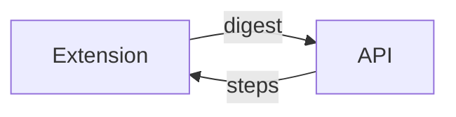

# Diagrams

Source files for diagrams used elsewhere in the docs.

## Convention

Diagrams are **ASCII or Mermaid in the document that uses them**, not exported
images. A diagram that lives in a binary cannot be reviewed in a pull request,
and drifts from the code within a release or two.

This folder holds source only for diagrams too large to inline, or ones reused
across several documents.

## Where the current diagrams live

| Diagram | Document |
|---|---|
| System shape | [00_OVERVIEW](../architecture/00_OVERVIEW.md#shape-of-the-system) |
| Four layers | [03_SYSTEM_ARCHITECTURE](../architecture/03_SYSTEM_ARCHITECTURE.md#layers) |
| Request → action | [05_DATA_FLOW](../architecture/05_DATA_FLOW.md) |
| Execution pipeline | [06_EXECUTION_PIPELINE](../architecture/06_EXECUTION_PIPELINE.md) |
| Trust boundaries | [08_SECURITY_MODEL](../architecture/08_SECURITY_MODEL.md#trust-boundaries) |

## Adding one

Prefer Mermaid — it renders on GitHub and diffs as text:

````markdown

````

If a diagram needs a tool, commit the editable source here alongside the
export, so the next person can change it.
